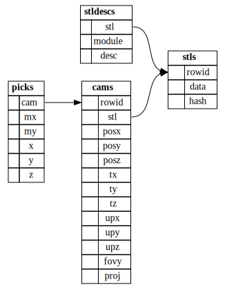

# waterfall-picker

This is a c raylib program for the following sqlite3 database schema:

[waterfall cad](https://github.com/joe-warren/opencascade-hs#readme) has no
feature to pick points on a model. A separate quasiquoter will generate the
initial sqlite database, and call this waterfall-picker program. With the mouse, the user
picks points on the model. If the model changes, waterfall-picker will be able
to replay the user's selection on the changed model.

## Build

    cmake .
    make
    ./waterfall-picker

## TODO

- [ ] keybinding to cycle between stls?
- [ ] mouse binding to rotate the light?
- [ ] checkerboard.png doesn't seem to be be attached though it is somehow necessary?
- [ ] argument parsing to replay? to review? without opening a window?
- [ ] DrawUI() y spacing off
